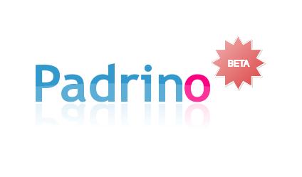

!SLIDE 
# Padrino #

!SLIDE commandline incremental

    $ whoami 
    Florian Gilcher 
    florian.gilcher@asquera.de
    twitter: @argorak
    github: skade
    Ruby programmer for 7 years 
    Now Ruby consultant
    Working on Padrino

!SLIDE center

# `$ whyami`

!SLIDE center

# `why am I here?`

!SLIDE
    
    May 9, 14:51
    FROM: Florian Gilcher
    
    Hi Padrino users,

    EuRuKo 2011 and (hopefully) Eurocamp are 
    drawing close (May 28-29). Are there any 
    Padrino users/hackers/interested 
    third-parties present in Berlin around 
    that date?

!SLIDE 

# As it turns out...

!SLIDE
    
    May 9, 16:00
    FROM: Alex Coles
    
    Hallo Florian, Ciao Davide,

    I'd encourage you to come along to eurucamp 
    and talk about Padrino. 
    There are lots of people interested.

!SLIDE

# Thanks for organizing!

!SLIDE

# http://padrinorb.com

!SLIDE

# http://tinyurl.com/3umkppp

!SLIDE

## https://gist.github.com/996871

!SLIDE 

# Some words upfront

!SLIDE bullets incremental

* I don't like presenting code
* Code deprecates
* Intention does not
* Our website guides are far better and maintained

!SLIDE bullets incremental
# Overview

!SLIDE

## We do that HTTP stuff

!SLIDE

##  Based on Sinatra

!SLIDE

## Just a Webframework

!SLIDE

## Agnostic

!SLIDE bullets
## No default model layer

!SLIDE center

## Usable, extensible admin interface

!SLIDE

# Flexibility is king

!SLIDE bullets incremental
# History

* Began its life as `sinatra-more`
* Turned into a framework by `Nathan Esquenazi` in 2009
* 8 core members now

!SLIDE bullets incremental

# Feature Hub

* If a feature is available, we want to encourage integration over plugins
* We prefer generic Rack/Sinatra over Padrino plugins
* But also want to make usage easy

!SLIDE

# Some core features

!SLIDE

## Complex Routing

!SLIDE

    @@@ruby
    Frontend.controller :movies do
      get :index do
        @movies = Movies.all
      end
      
      get :show, :with => :id do
        @movie = Movies.get(params[:id])
      end
    end
    
!SLIDE

## Rails style rendering

!SLIDE

    @@@ruby
    Frontend.controller :movies do
      get :index, :provides => [:html, :js, :xml] do
        @movies = Movies.all
        render 'movies/index'
      end
    end
    
!SLIDE bullets incremental

## Free selection of Model layer

* activerecord, datamapper, mongomapper, mongoid, sequel, couchrest, ohm, mongomatic
* all with rake tasks and everything

!SLIDE

## With admin generation

!SLIDE center

## From zero to usable in two commands

!SLIDE commandline incremental center

    $ padrino g admin
    $ padrino g admin_page my_model
    
!SLIDE center

!SLIDE bullets

## Support for other stuff to get you started immediately

!SLIDE bullets incremental

* all template libraries in `Tilt`
* all major js libraries
* less, sass, compass, etc.
* basic layouts for all major testing frameworks
* i18n and full translation in 17 languages

!SLIDE bullets
# Bonus

* You are absolutely free to implement javascript helpers

!SLIDE bullets
# Bonus

* You are absolutely free to implement javascript helpers, as long as you do it on your own.

!SLIDE

## Its a great exercise!

!SLIDE center

!SLIDE center

## Words of warning

!SLIDE center

## Padrino is a framework for developers interested in how their framework works.

!SLIDE center

!SLIDE center bullets incremental

## Experience

* Updating from 0.9.23 to 0.9.29 worked without problems.

!SLIDE center bullets

## Weird things happen

!SLIDE center bullets incremental

* Bundler automatically switching your YAML parser from Syck to Psych
* Rake turning 0.9 after ages