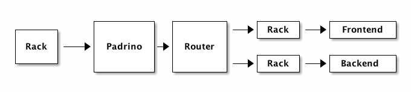

!SLIDE 
# Usage Styles #

!SLIDE 
## As Sinatra plugin 

!SLIDE code

    @@@ruby
    class MyApp < Sinatra::Application
      register Padrino::Routing
      register Padrino::Rendering
      
      get "/" do
        ...
      end
    end

!SLIDE 
## Single File 

!SLIDE code

    @@@ruby
    class MyApp < Padrino::Application
      enable :sessions
      disable :flash
      
      register MyExtension
      
      get :index do
      
      end
    end

!SLIDE

## Tiny Profile

!SLIDE

    $ padrino gen project eurucamp \
       --tiny

!SLIDE

    |
    \- app
    | |- app.rb
    | |- controllers.rb
    | |- helpers.rb
    | |- mailers.rb
    | \- views
    | | \- ....
    | \- models 
    \- config
    | |- apps.rb
    | |- boot.rb

!SLIDE center
    
## Full Profile 

!SLIDE commandline incremental

    $ padrino gen project eurucamp \
        --adapter=sqlite \
        --orm=datamapper \
        --test=rspec \
        --mock=mocha \
        --script=jquery \
        --renderer=erb \
        --stylesheet=less \
        --bundle \
        --dev
    
!SLIDE

    |
    \- app
    | |- app.rb
    | \- controllers
    | \- models
    | \- helpers
    | \- mailers
    | \- views
    | \- models 
    \- config
    | |- apps.rb
    | |- boot.rb
    | |- database.rb
    \- test
      |- test_config.rb

!SLIDE 

## Full Profile with multiple independent apps

!SLIDE

    |
    \- frontend
    | |- app.rb
    | \- controllers
    | \- models
    | \- helpers
    | \- mailers
    | \- views
    | \- models
    \- admin
    | \- ...
    \- upload_location
    | \- ...
    \- config
    | |- apps.rb
    | |- boot.rb
    | |- database.rb

!SLIDE

## No Magic

!SLIDE

## boot.rb

!SLIDE
    
    @@@ruby
    # Defines our constants
    PADRINO_ENV  = ...
    PADRINO_ROOT = ...
    
    # Load our dependencies
    require 'rubygems' unless defined?(Gem)
    require 'bundler/setup'
    Bundler.require(:default, PADRINO_ENV)
    
    # Load the framework
    Padrino.after_load do
      DataMapper.finalize
    end
    
    Padrino.load!

!SLIDE

# Back to simple

!SLIDE bullets incremental

## Easy to reimplement on your own

* you hate Bundler
* you want to load a Padrino app into some other framework

!SLIDE bullets incremental

* `Padrino.load!` ain't a lot of magic as well

!SLIDE center

## apps.rb

!SLIDE 

    @@@ruby
    Padrino.configure_apps do
      enable :sessions
      set :session_secret, '...'
    end

    Padrino.mount("Eurucamp")
           .to('/')
           .host("padrino.eurucamp.org")
    Padrino.mount("Admin").to("/admin")

!SLIDE center

# Just Rack

!SLIDE center

!SLIDE

# Why would I want that?

!SLIDE bullets incremental

* Isolation
* Fine grained configuration
* Testing, Testing, Testing!

!SLIDE center

!SLIDE center

# Hackability!

!SLIDE bullets

# All you need to know:

* Sinatra
* Rack
* Reading Ruby
* Your favourite libs to integrate